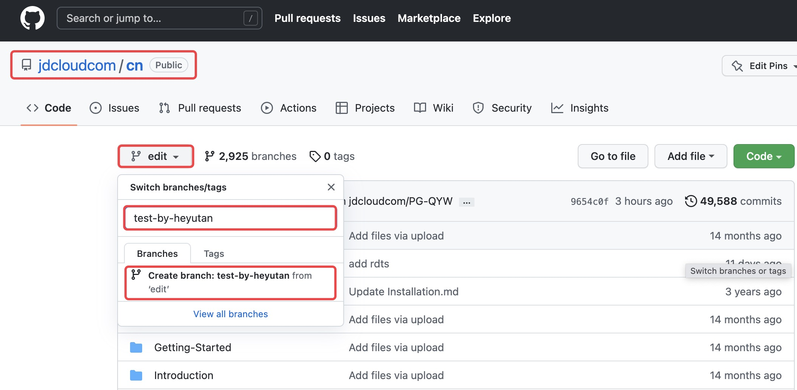

# 使用Typora和Github上线官网文档

## 一、Github

### 1.注册github账号

拥有一个github账号，无定制化操作，参考[链接](https://cf.jd.com/pages/viewpage.action?pageId=150212147)。

### 2.github权限

京东云官方文档的项目（project）位置：https://github.com/jdcloudcom/cn

在此项目中，如果你没有`create branch`的权限，例如在下图的`edit`分支下拉菜单中，如果没有提示你新建分支，则需要联系管理员姚佳（yaojia6）添加权限。



### 3.创建文件目录和占位文件

点击`Add file`后选择`Create new file`


通过使用`/`创建文件目录，首次创建目录必须要生成一个占位文件。

例如下图中的 `test0/test1/` 为目录，`test2.md` 为占位文件，内容可以自定义。


创建完成后效果如下：


目录创建完成之后，就可以通过`upload files`按钮上传本地的Markdown文档到指定目录了。


## 二、上线文档

文档的演进链条为：本地文档--github文档--官网上线文档

### 1.文档标准

- 文档名称必须使用英文命名，否则后续上传到github上可以正常解码和预览，但是从github上线到官网将会失败，上线邮件告警会提示路径错误，此邮件告警可联系姚佳获取；

- 插入的图片必须使用英文命名，否则后续上传到github上可以正常解码和预览，但是图片在京东云官网无法显示。


### 2.图片上传

#### （1）使用Github上传方式

京东云官网文档存储图片的文件夹`cn/image/` ，我们上传一张图片到`cn/image/Best-Practice/WIPM/1.joy.png`，其中`/Best-Practice/WIPM/1.joy.png` 为本次测试上传的图片，不同产品线的产品经理创建自定义名称的文件夹并上传图片。

<div align="left"></div>


接下来，我们看看文档 `cn/documentation/Best-Practice/Learn-Best-Practice/Built-Websites/test.md` 如何引用这张图片呢？

插入图片的方法可以参考以下两种方法：

```shell
#HTML语法，在github上支持更多参数调整图片，但是京东云官网文档并没有读取这些参数


#Markdown语法，不支持自定义图片参数

```


其中 `../../../../` 与Linux shell中的作用相同，为连续返回父文件夹4次，正好返回到 `cn` 目录下，而`image`正是在 `cn` 目录下，这样就实现了通过目录路径引用了图片，我们看一下预览效果：


#### （2）使用官网OSS方式

联系官网团队肖帅（xiaoshuai11）提前将文件上传到OSS，我的项目中，肖帅为最佳实践文档在京东云对象存储的存储桶 `img1` 下创建了文件夹`cn/best-practice` ，完整的公开链接如下：

```
https://img1.jcloudcs.com/cn/best-practice
```

例如，我的本地图片目录如下，此目录经肖帅直接上传到了`https://img1.jcloudcs.com/cn/best-practice`

<div align='left'></div>

这样对比规律，在本地的Typora文档中批量替换如下字段，即可实现本地化图片替换成云存储图片。

- 本地被替换字段：`/Users/heyutan/Documents/0-Super结构化资料/8.写作/官网最佳实践文档/Picture-EN`
- 替换成为：`https://img1.jcloudcs.com/cn/best-practice`

```shell
#替换前


#替换后

```

#### （3）图片样式的测试

目前测试的效果包含缩放、位置，更多测试还需在更多官网上线文档中增加测试图片。

| 基于html语法的图片样式       | 作用 | Typora                                                       | Github | 官网上线 |
| ---------------------------- | ---- | ------------------------------------------------------------ | ------ | -------- |
| style="zoom:70%;"            | 缩放 | 默认                                                         | 不识别 | 不识别   |
| style="width:70%;"           | 缩放 | 识别<br>但是需要批量替换zoom实现批量修改，且缩放幅度大于zoom | 识别   | 不识别   |
| width=600                    | 缩放 | 识别                                                         | 识别   | ？？     |
| `<div align="center"></div>` | 居中 | 识别                                                         | 识别   | ？？     |
| <div align="left"></div>     | 居左 | 识别                                                         | 识别   | ？？     |
|                              |      |                                                              |        |          |

本地Typora测试效果演示。

（a）测试居左和缩放`style="width:10%;`

```html
<div align='left'></div>
```

<div align='left'></div>

（b）测试居右和缩放`width=200`

```html
<div align='right'></div>
```

<div align='right'></div>

### 3.各文档间的引用

建议文档上线后，使用公网链接互相引用为佳。

### 4.代码块

大小写敏感，例如在Typora中识别`shell` ，但是官网上线只识别`Shell`。

全部可识别语言参考：https://cf.jd.com/pages/viewpage.action?pageId=162230371


